# 🏢 Company Information

AtliQ Hardware is one of India's leading computer hardware manufacturers, serving customers across multiple international markets. The company specializes in delivering high-quality technology products through various sales platforms and channels. This project analyzes AtliQ Hardware's business data to answer ad-hoc business requests using SQL.

## 📦 Company Product Structure

The company's products are organized into a hierarchical structure, allowing efficient categorization and analysis.

## 🌐 Platforms

- Brick & Mortar
- E-Commerce

## 🛒 Market Channels

- Retailer
- Distributor
- Direct

## 🖼️ Company Structure Overview

  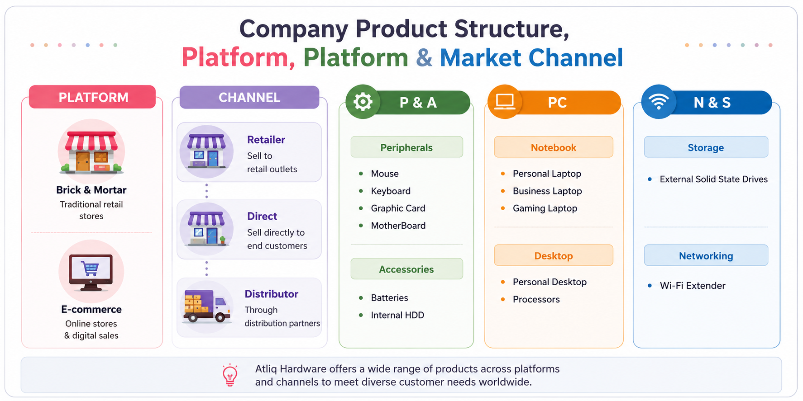

---

# 🗂️ Data Model Structure

The project follows a relational data model consisting of fact and dimension tables. The schema connects multiple dimension tables with transactional fact tables, enabling efficient business analysis and reporting.

  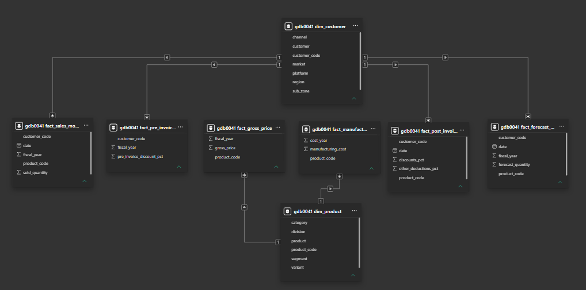

---

# 📌 Ad-hoc Business Requests & Solutions

## 🔹 Request 1

### Business Request
Provide the list of markets in which customer **"Atliq Exclusive"** operates within the APAC region.

### SQL Query

### Output
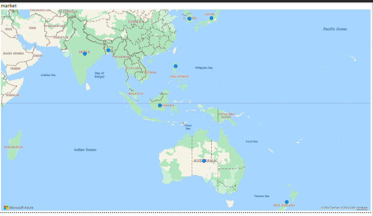

---

## 🔹 Request 2

### Business Request
What is the percentage increase of unique products in 2021 compared to 2020?

### SQL Query
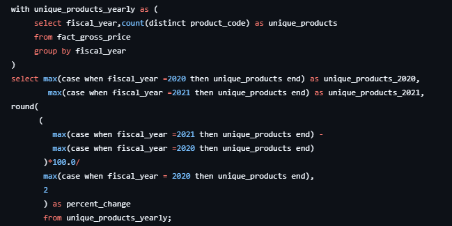

### Output
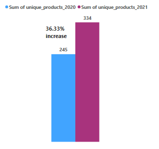

---

## 🔹 Request 3

### Business Request
Provide a report containing the unique product count for each segment.

### SQL Query
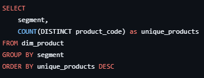

### Output
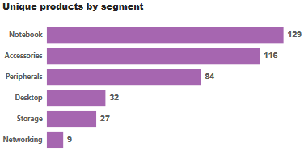

---

## 🔹 Request 4

### Business Request
Which segment had the highest increase in unique products in 2021 compared to 2020?

### SQL Query
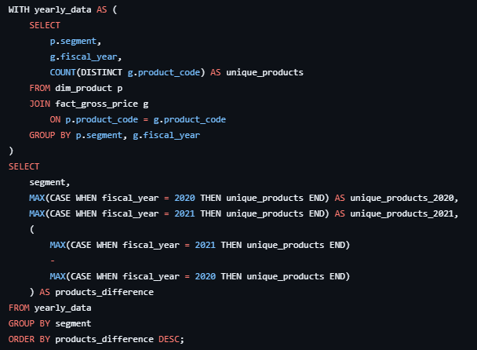

### Output
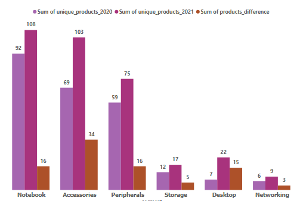

---

## 🔹 Request 5

### Business Request
Retrieve the products with the highest and lowest manufacturing costs.

### SQL Query
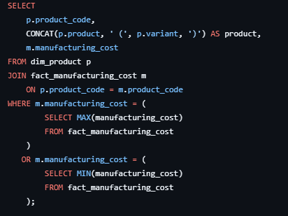

### Output

---

## 🔹 Request 6

### Business Request
Generate the Top 5 customers who received the highest average pre-invoice discount percentage for FY2021 in the Indian market.

### SQL Query
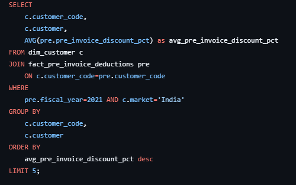

### Output
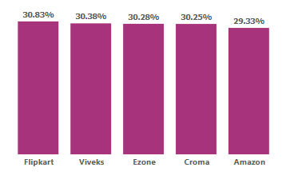

---

## 🔹 Request 7

### Business Request
Calculate the monthly gross sales amount for customer **Atliq Exclusive**.

### SQL Query
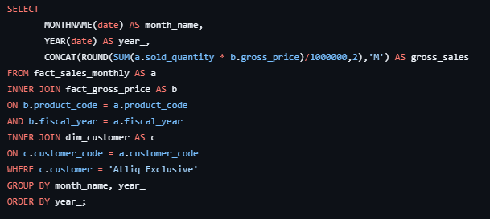

### Output

---

## 🔹 Request 8

### Business Request
In which quarter of 2020 did the company achieve the maximum total sold quantity?

### SQL Query
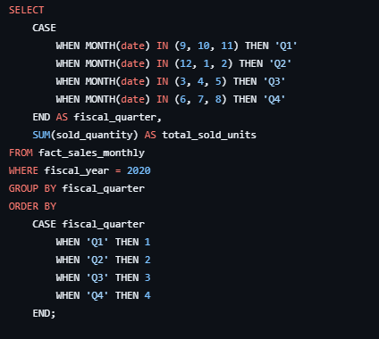

### Output
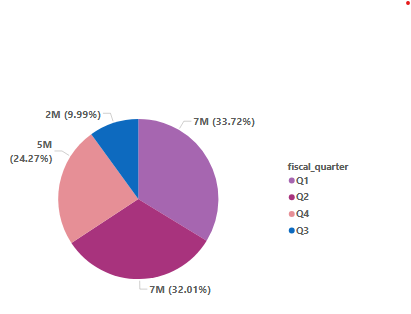

---

## 🔹 Request 9

### Business Request
Which sales channel contributed the highest gross sales in FY2021, and what was its percentage contribution?

### SQL Query
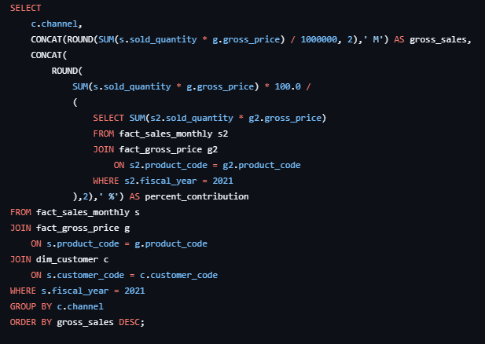

### Output
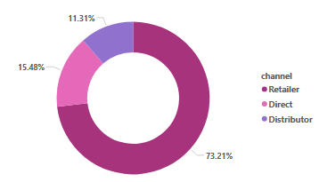

---

## 🔹 Request 10

### Business Request
Retrieve the Top 3 products in each division based on total sold quantity in FY2021.

### SQL Query
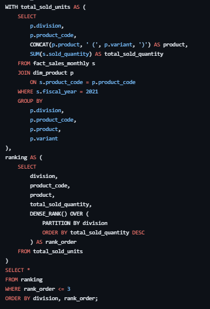

### Output (Part 1)
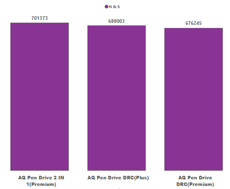

### Output (Part 2)
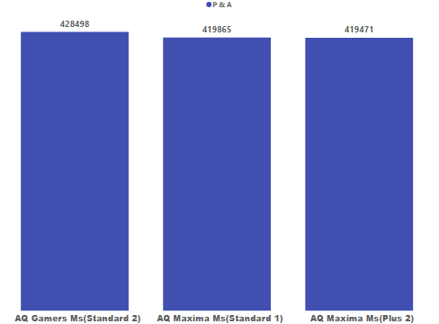

### Output (Part 3)
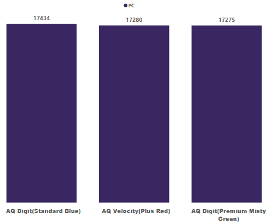

---

